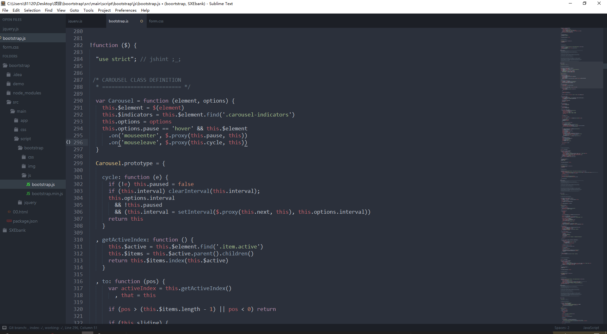

# 一些简单的sublime插件和主题的配置
### 主题是本人非常喜欢的风格

> 主题用的pacegray.sublime-theme 基本配置如下
```
"spacegray_fileicons": true,
"spacegray_sidebar_font_xlarge": true,
"spacegray_sidebar_tree_xlarge": true,
"spacegray_tabs_font_large": true,
"spacegray_tabs_xlarge": true,
"theme": "Spacegray.sublime-theme",
"word_wrap": true
```
### 插件推荐
`Sublime APICloud Plugins`
> Sublime APICloud Plugins是APICloud为开发者提供的一套开源的Sublime Text扩展插件，包括：应用管理、应用框架、页面模板、代码提示、代码管理、Widget打包、真机同步、日志输出、管理自定义AppLoader等功能，其他的功能插件也在不断增加，这些插件已被Package Control成功收录，开发者可以直接在Sublime Text3中下载安装；所有插件都已开源，开发者也可以在此基础上按需求扩展自己的插件。

`FileDiffs`
> FileDiffs插件可以让开发者比较两个不同文件的差异，比较的对象包括当前文件、另一文件、剪切板中的代码甚至未保存文件等。

`Git`
> 虽然名字看上去并不友好，但作为开发者的你肯定一眼就能明白它是干什么的。这个插件会将Git整合进你的SublimeText，使的你可以在SublimeText中运行Git命令，包括添加，提交文件，查看日志，文件注解以及其它Git功能。

`ColorPicker`
>如果你经常要查看或设置颜色值，这个插件可以很方便地调用你本机的调色板应用。（译者扩充：）这是一个双向的功能，你既可以在调色板中选择一个颜色，然后按“确定”按钮把该值填写到 SublimeText 中活动文档的当前位置，也可以在活动文档中选择一个颜色的值，按此插件的快捷键就会在显示的调色板中定位到该值所对应的颜色。

`IMESupport`
Sublime Text 中文输入法框跟不上光标的解决方案
